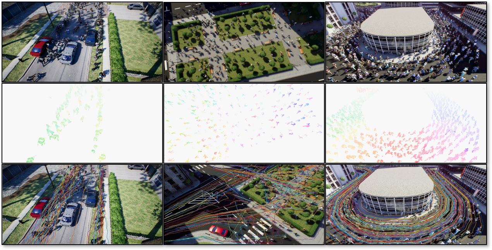

## TUB CrowdFlow Dataset
Optical Flow Dataset and Evaluation Kit for Visual Crowd Analysis developed at [Communication Systems Group](https://www.nue.tu-berlin.de/) at TU-Berlin desciribed in the AVSS 2018 paper 
[Optical Flow Dataset and Benchmark for Visual Crowd Analysis](http://elvera.nue.tu-berlin.de/files/1548Schr%C3%B6der2018.pdf) or [TUBCrowdFlow@arxiv.org](https://arxiv.org/abs/1811.07170).

This evaluation framework is released under the MIT License (details in [LICENSE](LICENSE)).
If you use the dataset or evaluation kit or think our work is useful in your research, please consider citing:

```
@INPROCEEDINGS{TUBCrowdFlow2018,
	AUTHOR = {Gregory Schr{\"o}der and Tobias Senst and Erik Bochinski and Thomas Sikora},
	TITLE = {Optical Flow Dataset and Benchmark for Visual Crowd Analysis},
	BOOKTITLE = {IEEE International Conference on Advanced Video and Signals-based Surveillance},
	YEAR = {2018},
}
```

Download the dataset via:
```
wget http://ftp01.nue.tu-berlin.de/crowdflow/TUBCrowdFlow.rar
```
or use the following direct links
 - [http://ftp01.nue.tu-berlin.de/crowdflow/TUBCrowdFlow.rar](http://ftp01.nue.tu-berlin.de/crowdflow/TUBCrowdFlow.rar)
 - [https://tubcloud.tu-berlin.de/s/jENg4fcgeBPwGfN](https://tubcloud.tu-berlin.de/s/jENg4fcgeBPwGfN)
 
and unpack it:
```
sudo apt-get install unrar
unrar x TUBCrowdFlow
```
**The TUB CrowdFlow dataset is made available for academic use only.** If you wish to use this dataset commercially please contact  [sikora@nue.tu-berlin.de](mailto:sikora@nue.tu-berlin.de).

### Installation
Minimum required python version: 3.5

**Install dependencies on Ubuntu:**
```
sudo apt-get install python3-dev python3-virtualenv virtualenv
```
Create a virtual environment and install python requirements:
```
virtualenv -p python3 crowdflow_env
source crowdflow_env/bin/activate
pip3 install numpy progressbar2 opencv-contrib-python
```

## Evaluation Framework
To evaluate an optical flow method with the providen framework perform these step:
 * create a new directory in the `/TUBCrowdFlow/estimate` directory. 
 * compute flow fields and save them in *.flo* fileformat with the structure given in by the 
 `/TUBCrowdFlow/images` directory.  For example optical flow results from the image pair  `/TUBCrowdFlow/images/IM01/frame_0000.png` and `/TUBCrowdFlow/images/IM01/frame_0001.png`
 must be stored as `/estimate/[mymethod]/images/IM01/frame_0000.flo
 * run `opticalflow_evaluate.py` to compute EPE and R2 short-term metrics.
 * run `trajectory_evaluate.py` to compute tracking accuracy long-term metrics.

**Optical Flow Samples**

`
opticalflow_estimate.py <dataset_root_path> <flow_method_name_1> <flow_method_name_2> ...
`

With the following program optical flow fields for the TUB CrowdFlow dataset will be estimated with Dual-TVL1.
```
source crowdflow_env/bin/activate
python3 opticalflow_estimate.py TUBCrowdFlow/ dual farneback plk
```
The optical flow files will be stored in the directory `/estimate/dual/` . 

**Short-Term Evaluation**

`
opticalflow_evaluate.py <dataset_root_path> <dir_name_method_1> <dir_name_method_2> ... <dir_name_method_n> 
`

Example:
```
source crowdflow_env/bin/activate
python3 opticalflow_evaluate.py TUBCrowdFlow/ dual plk farneback
```
After execution the file *short_term_results.tex* will contain the evaluation results (*method 1 - method n*) in form of a latex table.
*short_term_results.pb* will contain the evaluation results stored with pickle.

**Long-Term  Evaluate**

`
trajectory_evaluate.py <dataset_root_path> <dir_name_method_1> <dir_name_method_2> ... <dir_name_method_n>
`

Example:
```
source crowdflow_env/bin/activate
python3 trajectory_evaluate.py TUBCrowdFlow/ dual plk farneback 
```
After execution the file *long_term_results.tex* will contain the evaluation results (*method 1 - method n*) in form of a latex table.
*long_term_results.pb* will contain the evaluation results stored with pickle.

## Results
To assess the quality of the optical flow we propose to use two types of metrics: i) common optical flow metrics, i.e. average endpoint error (EPE) and percentage of erroneous
pixel (RX) and ii) long-term motion metrics based on trajectories. An detailed overview of the optical flow parameters can be found in the document: [Supplemental_materials.pdf](./Supplemental_material.pdf)).
### Common optical flow metrics (short-term)

|            |FG (Static)| FG (Static)| BG (Static)|BG (Static) |FG (Dynamic)| FG (Dynamic) | BG (Dynamic)    | BG (Dynamic)     | FG(Avg.)| FG(Avg.)     | BG(Avg.) | BG(Avg.)   |  Avg.  |Avg. || 
| ---------- | -----  | ----- | ----- | ---- | ----- | ----- | ------ | ----- | ----- | ------ | ----- | ----- | ----- | ----- | ----- |
|           | EPE |R2[%] |EPE  |R2[%] |EPE   |R2[%]  |EPE  |R2[%] |EPE   |R2[%]  |EPE |R2[%]   |EPE    |R2[%] |t[sec]|
| **[FlowFields (Bailer2015)](https://av.dfki.de/publications/flow-fields-dense-correspondence-fields-for-highly-accurate-large-displacement-optical-flow-estimation/)** | 0.756 | 8.27  | 0.213 | 2.79 | 1.069 | 14.92 | 2.571  | 51.42 | 0.913 | 11.595 | 1.392 | 27.10 | 0.915 | 11.74 | 43.53 |
| **[RIC (Hu2017)](https://github.com/YinlinHu/Ric)**        | 0.859 | 8.64  | 0.243 | 3.31 | 1.166 | 15.69 | 2.623  | 53.58 | 1.013 | 12.164 | 1.433 | 28.45 | 1.015 | 12.32 | 8.30 |
|**[CPM (Li2018)](https://github.com/YinlinHu/CPM)**         |0.701 |7.09 |0.247 |3.63 |1.026 |13.94 |2.585 |51.78 |0.864 |10.517 |1.416 |27.71 |0.868 |10.69 |14.74|
|**[DeepFlow (Weinzaepfel2013)](https://thoth.inrialpes.fr/src/deepflow/)**    |0.629 |6.19 |0.237 |3.67 |1.005 |13.95 |2.594 |51.67 |0.817 |10.069 |1.416 |27.67 |0.822 |10.25 |39.63|
|**[RLOF6 (Geistert2016)](https://github.com/tsenst/RLOFLib)**       |0.753 |8.61 |0.315 |5.00 |1.088 |15.61 |2.655 |53.47 |0.921 |12.112 |1.485 |29.23 |0.924 |12.27 |1.49|
|**[RLOF10 (Geistert2016)](https://github.com/tsenst/RLOFLib)**      |0.772 |8.80 |0.324 |5.10 |1.104 |15.80 |2.658 |53.60 |0.938 |12.303 |1.491 |29.35 |0.941 |12.46 |0.80|
|**[DIS4 (Kroeger2016)](https://github.com/tikroeger/OF_DIS)**        |0.627 |5.72 |0.356 |5.85 |0.928 |11.86 |2.665 |53.67 |0.777 |8.790  |1.511 |29.76 |0.784 |9.01  |1.70|
|**[DIS2 (Kroeger2016)](https://github.com/tikroeger/OF_DIS)**        |1.441 |20.40|0.528 |8.24 |1.726 |27.41 |3.001 |64.01 |1.583 |23.903 |1.765 |36.13 |1.579 |23.92 |0.28|
|**[Farneback (Farneback2003)](http://www.diva-portal.org/smash/get/diva2:273847/FULLTEXT01.pdf)**   |0.737 |7.21 |0.441 |7.30 |0.996 |12.67 |2.491 |50.60 |0.867 |9.940  |1.466 | 28.95|0.872 |10.13 |    |
|**[Sparse to Dense PLK (Bouguet2000)](http://robots.stanford.edu/cs223b04/algo_tracking.pdf)** | 0.793 | 8.07 | 0.563 | 9.12 | 1.041 | 13.24 | 2.875 | 56.29 | 0.917 | 10.653 | 1.719 | 32.71 | 0.925 | 10.88 |    |

### Tracking Accuracy (long-term)

**Dense Trajectories**

|           |IM01 |(Dyn) |IM02   |(Dyn)|IM03  |(Dyn) |IM04  |(Dyn) |IM05  |(Dyn) |Avg. |
| --------- | --- | ---- | ---- | ---- | ---- | ---- | ---- | ---  | ---- | ---- | --- | 
| **[FlowFields (Bailer2015)](https://av.dfki.de/publications/flow-fields-dense-correspondence-fields-for-highly-accurate-large-displacement-optical-flow-estimation/)** |70.63| 61.79| 56.69 |45.93| 71.46| 68.35| 42.27| 37.63| 65.15| 59.61| 57.95|
| **[RIC (Hu2017)](https://github.com/YinlinHu/Ric)**        |74.39| 69.41| 58.72 |50.33| 54.18| 73.80| 44.21| 39.52| 60.23| 60.28| 58.51|
|**[CPM (Li2018)](https://github.com/YinlinHu/CPM)**         |73.41| 65.16| 58.31 |47.57| 74.41| 71.13| 46.23| 41.15| 67.97| 61.68| 60.70|
|**[DeepFlow (Weinzaepfel2013)](https://thoth.inrialpes.fr/src/deepflow/)**    |83.84| 81.90| 63.33 |55.52| 83.38| 80.87| 57.08| 56.65| 71.25| 64.67| 69.85|
|**[RLOF6 (Geistert2016)](https://github.com/tsenst/RLOFLib)**       |82.80| 78.31| 63.16 |57.68| 87.46| 86.76| 50.56| 50.53| 69.86| 68.73| 69.59|
|**[RLOF10 (Geistert2016)](https://github.com/tsenst/RLOFLib)**      |80.14| 73.95| 62.05 |55.54| 85.44| 84.39| 48.80| 47.84| 67.53| 67.41| 67.31|
|**[DIS4 (Kroeger2016)](https://github.com/tikroeger/OF_DIS)**        |80.44| 76.19| 64.11 |56.99| 82.89| 82.24| 53.91| 52.75| 72.11| 70.71| 69.23|
|**[DIS2 (Kroeger2016)](https://github.com/tikroeger/OF_DIS)**        |47.55| 33.03| 36.52 |25.32| 22.59| 19.76| 26.79| 20.89| 27.63| 27.91| 28.80|
|**[Farneback (Farneback2003)](http://www.diva-portal.org/smash/get/diva2:273847/FULLTEXT01.pdf)**   |78.69| 74.24| 65.22 |59.43| 86.89| 87.17| 52.85| 55.29| 70.22| 68.94| 69.89|
|**[Sparse to Dense PLK (Bouguet2000)](http://robots.stanford.edu/cs223b04/algo_tracking.pdf)** |75.15| 68.54| 64.71 |57.88| 84.71| 84.11| 50.08| 49.26| 68.45| 69.75| 67.26| 

**Person Trajectories**

|           | IM01|(Dyn)|IM02 |(Dyn)|IM03 |(Dyn)| IM04 |(Dyn)|IM05  |(Dyn) | Avg.   |
| --------- |  --- | --- | --- | --- | --- | --- | ---- | --- | ---- | ---- | ------ |
| **[FlowFields (Bailer2015)](https://av.dfki.de/publications/flow-fields-dense-correspondence-fields-for-highly-accurate-large-displacement-optical-flow-estimation/)** | 77.94| 62.68| 52.35| 38.22| 66.76| 63.17| 30.09| 25.24| 65.67| 68.20| 55.03 |
| **[RIC (Hu2017)](https://github.com/YinlinHu/Ric)**        | 87.88| 80.87| 56.56| 48.14| 43.49| 70.98| 32.48| 27.81| 57.47| 68.56| 57.42|
|**[CPM (Li2018)](https://github.com/YinlinHu/CPM)**         | 82.17| 68.82| 54.56| 40.99| 70.37| 66.69| 35.98| 30.00| 69.64| 71.58| 59.08|
|**[DeepFlow (Weinzaepfel2013)](https://thoth.inrialpes.fr/src/deepflow/)**    | 99.19| 95.32| 68.60| 63.04| 83.18| 81.20| 53.82| 52.22| 76.32| 79.15| 75.20|
|**[RLOF6 (Geistert2016)](https://github.com/tsenst/RLOFLib)**       | 97.70| 92.37| 66.70| 65.08| 88.73| 90.22| 43.56| 46.47| 72.60| 80.12| 74.36|
|**[RLOF10 (Geistert2016)](https://github.com/tsenst/RLOFLib)**      |96.00 | 85.02| 63.08| 59.77| 85.97| 86.69| 39.41| 40.48| 69.09| 78.70| 70.42|
|**[DIS4 (Kroeger2016)](https://github.com/tikroeger/OF_DIS)**        | 92.22| 85.98| 63.97| 56.35| 81.59| 81.61| 44.58| 42.64| 74.95| 82.09| 70.60|
|**[DIS2 (Kroeger2016)](https://github.com/tikroeger/OF_DIS)**        | 40.81| 22.39| 22.86| 15.37| 9.05 | 6.72 | 13.63| 9.72 | 17.86| 18.10| 17.65 |
|**[Farneback (Farneback2003)](http://www.diva-portal.org/smash/get/diva2:273847/FULLTEXT01.pdf)**   | 88.75| 81.33| 64.69| 59.05| 85.92| 87.44| 42.42| 45.35| 71.51| 79.63| 70.61| 
|**[Sparse to Dense PLK (Bouguet2000)](http://robots.stanford.edu/cs223b04/algo_tracking.pdf)** | 79.31| 66.83| 61.05| 52.41| 82.63| 83.11| 37.92| 36.81| 67.53| 76.18| 64.38|
|**[NMC (IDREES2014)](https://www.sciencedirect.com/science/article/pii/S0262885613001637)** | 96.96 | 90.33 | 72.18 | 71.44 | 92.28 | 20.70 | 32.72 | 42.38 | 60.15 | 56.02 | 63.52 |


## Contact
If you have any questions or encounter problems regarding the method/code or want to send us your optical flow benchmark 
results feel free to contact me
at [senst@nue.tu-berlin.de](mailto:senst@nue.tu-berlin.de)

## References - Optical Flow Algorithm

```
@inproceedings
{Bailer2015,
  title = {Flow Fields: Dense Correspondence Fields for Highly Accurate Large Displacement Optical Flow Estimation},
  author={Bailer, C. and Taetz, B. and Stricker, D.},
  booktitle = {International Conference on Computer Vision},
  pages={4015--4023},
  year = {2015}
}
```
```
@inproceedings{Hu2017,
  title={Robust interpolation of correspondences for large displacement optical flow},
  author={Hu, Y. and Li, Y. and Song, R.},
  booktitle={Conference on Computer Vision and Pattern Recognition},
  pages={4791--4799},
  year={2017},
}
```
```
@article{Li2018, 
  author={Y. Li and Y. Hu and R. Song and P. Rao and Y. Wang}, 
  journal={IEEE Transactions on Circuits and Systems for Video Technology}, 
  title={Coarse-to-Fine PatchMatch for Dense Correspondence}, 
  year={2018}, 
  volume={28}, 
  number={9}, 
  pages={2233-2245}, 
}
```
```
@inproceedings{Weinzaepfel2013,
  AUTHOR = {Weinzaepfel, Philippe and Revaud, Jerome and Harchaoui, Zaid and Schmid, Cordelia},
  TITLE = {{DeepFlow: Large displacement optical flow with deep matching}},
  BOOKTITLE = {{Intenational Conference on Computer Vision }},
  YEAR = {2013},
}
```
```
@inproceedings{Geistert2016,
	AUTHOR = {Jonas Geistert and Tobias Senst and Thomas Sikora},
	TITLE = {Robust Local Optical Flow: Dense Motion Vector Field Interpolation},
	BOOKTITLE = {Picture Coding Symposium},
	YEAR = {2016},
	PAGES = {1--5},
}
```
```
@inproceedings{Kroeger2016, 
  Author = {Till Kroeger and Radu Timofte and Dengxin Dai and Luc Van Gool}, 
  Title = {Fast Optical Flow using Dense Inverse Search}, 
  Booktitle = {European Conference on Computer Vision }, 
  Year = {2016}
 }
```
```
@inproceedings{Farneback2003,
  Author = 	 {Gunnar Farneb{\"a}ck},
  Title = 	 {Two-Frame Motion Estimation Based on Polynomial Expansion},
  Booktitle = 	 {Proceedings of the 13th Scandinavian Conference on Image Analysis},
  Pages = 	 {363--370},
  Year = 	 {2003},
 }
```
```
@TECHREPORT{Bouguet2000,
  author = {J.-Y. Bouguet},
  title = {Pyramidal Implementation of the Lucas Kanade Feature Tracker},
  institution = {Intel Corporation Microprocessor Research Lab},
  year = {2000},
  type = {Technical {R}eport},
  publisher = {Intel Corporation Microprocessor Research Labs},
  timestamp = {2013.04.03}
}
```

## References - Person Tracking Algorithm

```
@article{IDREES2014,
 title = "Tracking in dense crowds using prominence and neighborhood motion concurrence",
 journal = "Image and Vision Computing",
 volume = "32",
 number = "1",
 pages = "14 - 26",
 year = "2014",
 author = "Haroon Idrees and Nolan Warner and Mubarak Shah",
}
```
